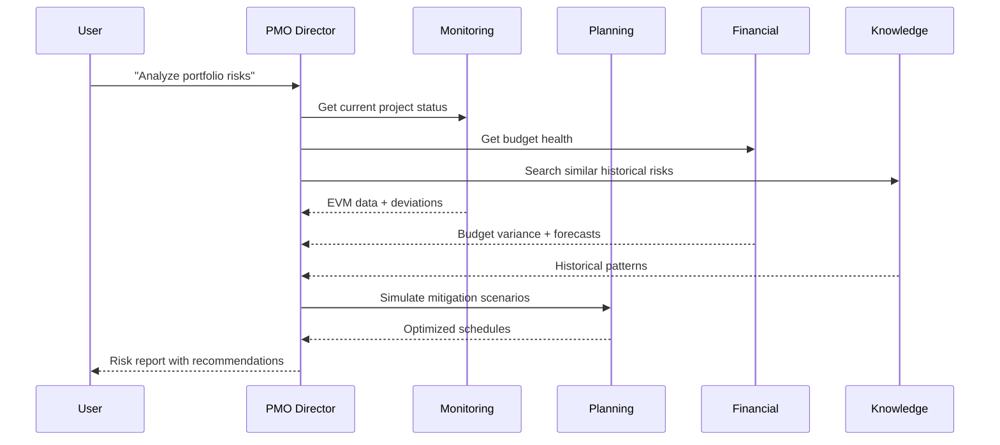

# AI-PMO: AI-Powered Project Management Office

## The Concept

Traditional PMO (Project Management Office) provides governance, standards, and oversight for project portfolios. But in construction, PMOs face unique challenges:

- **Data fragmentation** — information scattered across Excel, WhatsApp, email, paper
- **Reactive management** — problems discovered weeks or months late
- **Manual reporting** — PMs spend 40% of time writing reports instead of managing
- **Knowledge loss** — lessons learned never captured or reused

**AI-PMO** augments the traditional PMO with AI capabilities:

| Traditional PMO | AI-PMO |
|----------------|--------|
| Manual data collection | Automatic data aggregation from 1C, GPS, sensors |
| Periodic reporting | Real-time dashboards with AI insights |
| Expert judgment for risk | AI-powered risk prediction and mitigation |
| Post-mortem lessons | Continuous learning from all projects |
| Template-based planning | AI-optimized scheduling with constraint solving |

## The 5 AI Agents

### 1. PMO Director 🎯
**Role:** Strategic decision support

- Portfolio-level risk assessment
- Resource allocation optimization
- Strategic KPI tracking
- Cross-project dependency analysis

### 2. Planning Agent 📅
**Role:** Schedule optimization

- Critical path analysis
- Resource-constrained scheduling
- What-if scenario modeling
- Automatic schedule adjustments based on progress

### 3. Monitoring Agent 📡
**Role:** Real-time project tracking

- EVM calculation (CPI, SPI, EAC, TCPI)
- Deviation detection and alerting
- Trend analysis and forecasting
- Milestone tracking

### 4. Financial Control Agent 💰
**Role:** Budget and cost management

- Budget variance analysis
- Cash flow forecasting
- Cost overrun prediction
- Change order impact assessment

### 5. Knowledge Management Agent 📚
**Role:** Organizational learning

- RAG-based search across project documents
- Lessons learned extraction and indexing
- Best practice recommendations
- Historical pattern matching

## How They Work Together

## Business Impact

Based on the Severavtodor implementation study:

| Metric | Before AI-PMO | After AI-PMO | Improvement |
|--------|--------------|--------------|-------------|
| Report preparation time | 8 hours/week | 30 minutes | **94% reduction** |
| Problem detection lag | 2-4 weeks | Real-time | **Immediate** |
| Budget overrun rate | 25% | <5% (predicted) | **80% reduction** |
| Annual savings | — | ₽120M | **ROI 171%** |

## For Construction Specifically

AI-PMO addresses construction-specific challenges:

- **Seasonal constraints** — short construction windows in Arctic regions
- **Supply chain complexity** — winter roads (зимники), remote logistics
- **Multi-contractor coordination** — dozens of subcontractors per project
- **Regulatory compliance** — SNiP, GOST, FGIС requirements
- **Harsh environment** -50°C, limited connectivity, equipment failures

---

→ [Origin Story](origin-story.md) · [AI Agents Detail](agents.md) · [1C Integration](integration-1c.md)
