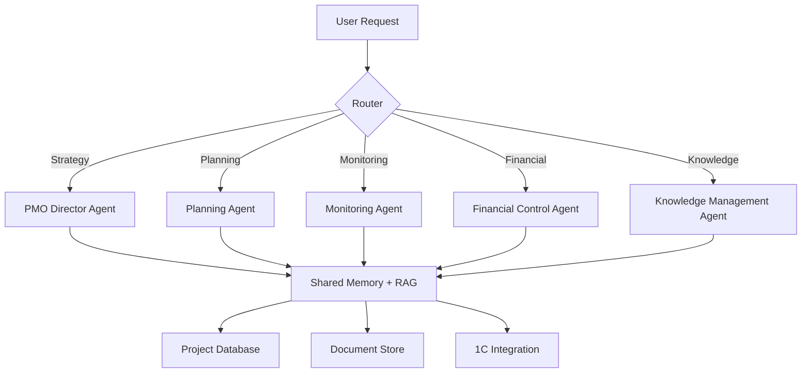
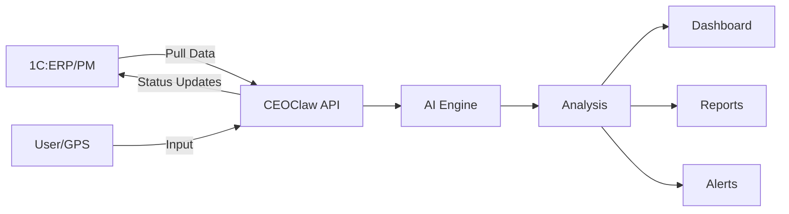

# Architecture

## High-Level Overview

```
┌─────────────────────────────────────────────────────────┐
│                    Frontend Layer                        │
│  Next.js 15 · React · Tailwind CSS · TypeScript         │
│  Multi-language (RU/EN/ZH) · PWA                        │
├─────────────────────────────────────────────────────────┤
│                    API Layer                             │
│  208 API Routes · REST + SSE · WebSocket (planned)       │
│  Authentication · Rate Limiting · Validation             │
├─────────────────────────────────────────────────────────┤
│                   Business Logic                         │
│  Project Service · EVM Engine · Risk Engine              │
│  Agent Orchestrator · Goal Service · Report Generator    │
├─────────────────────────────────────────────────────────┤
│                    AI Engine                             │
│  Multi-Provider Router (OpenRouter, ZAI, OpenAI)        │
│  5 Specialized Agents · RAG Pipeline · Memory System     │
│  Streaming · Function Calling · Context Management       │
├─────────────────────────────────────────────────────────┤
│                   Data Layer                             │
│  PostgreSQL · Prisma ORM (73 models)                     │
│  SQLite (local/offline fallback)                         │
├─────────────────────────────────────────────────────────┤
│                 External Integrations                    │
│  1C:ERP/PM · GPS/GLONASS · Yandex Maps · ФГИС ЦС       │
└─────────────────────────────────────────────────────────┘
```

## AI Engine

### Multi-Provider Architecture

CEOClaw routes AI requests through multiple providers for reliability and cost optimization:

```
Request → Provider Router → [OpenRouter] → Response
                          → [Zhipu AI]   → Response (fallback)
                          → [OpenAI]     → Response (fallback)
                          → [Ollama]     → Response (local fallback)
```

### Agent System

5 specialized AI agents, each with defined role and tools:



### Data Flow



## Technology Stack

| Component | Technology | Notes |
|-----------|-----------|-------|
| Frontend | Next.js 15, React 19 | App Router, Server Components |
| Styling | Tailwind CSS | Utility-first, dark mode, responsive |
| Language | TypeScript (strict) | Full type safety |
| Database | PostgreSQL | Primary data store |
| ORM | Prisma | 73 models, migrations, auto-generated types |
| AI Providers | OpenRouter, Zhipu AI, OpenAI | Multi-provider with fallback |
| Maps | Yandex Maps | Russian geography focus |
| Auth | NextAuth.js | Credential + OAuth providers |
| Deployment | Vercel | Edge functions, preview deploys |
| Monitoring | Custom (planned: Sentry) | Error tracking, performance |

## Deployment Architecture

### Current Stack (Production)
```
Frontend (Vercel)
  ↓ (Server Components)
Next.js 15 (Edge Functions)
  ↓
API Routes (REST + SSE)
  ↓
Business Logic Layer
  ↓
AI Engine (Multi-Provider Router)
  ↓
PostgreSQL (Managed: Supabase or Neon)
  ↓
External Integrations (1C, GPS, Maps)
```

### Production Environment
- **Frontend:** Vercel (CDN, edge caching, automatic SSL)
- **Database:** PostgreSQL 14+ (Supabase managed or Neon serverless)
- **Storage:** S3-compatible (Cloudflare R2 for cost efficiency)
- **Environment:** Production (verified via CI/CD pipeline)

### Development Environment
- **Frontend:** Next.js dev server (hot reload)
- **Database:** Local PostgreSQL or Docker PostgreSQL
- **AI:** Local models (Ollama) for testing
- **CI/CD:** GitHub Actions (automated tests + deployment)

### Scalability Considerations
- **Vertical scaling:** PostgreSQL read replicas for high-traffic periods
- **Horizontal scaling:** Stateless frontend (Vercel handles CDN)
- **Auto-scaling:** Vercel edge functions auto-scale to zero

## Security Considerations

- **No source code** in this repository — documentation only
- **API keys** managed via environment variables, never committed
- **Authentication** via NextAuth.js with credential providers
- **Data isolation** per organization (multi-tenant planned)
- **Audit logging** for all sensitive operations (planned)

---

*This is a high-level architectural overview. For technical implementation details, contact: alex@ceoclaw.com*
