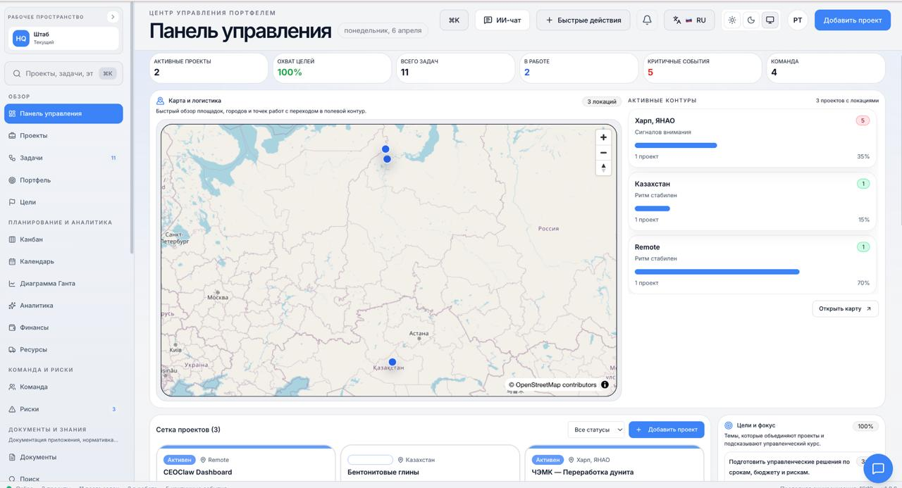
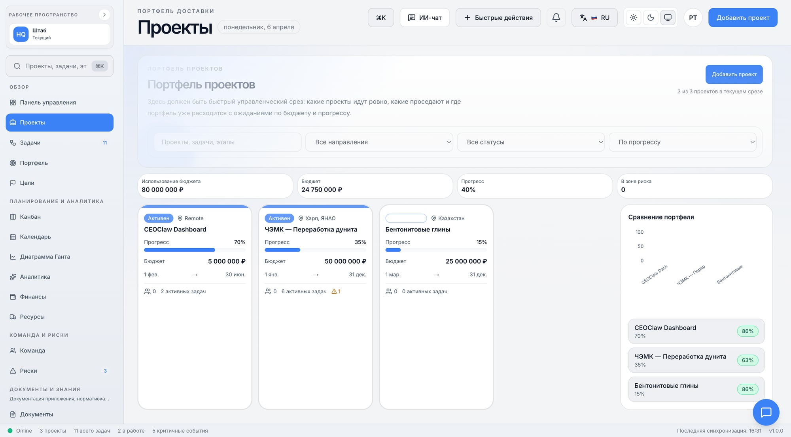
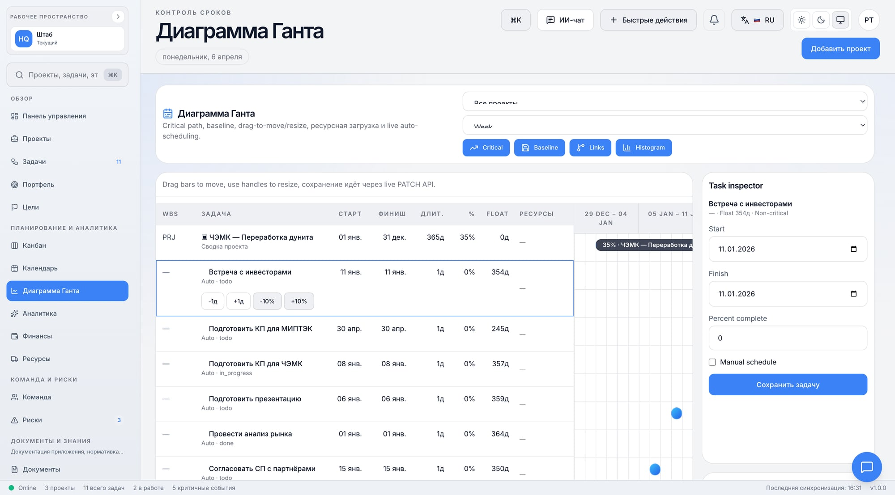
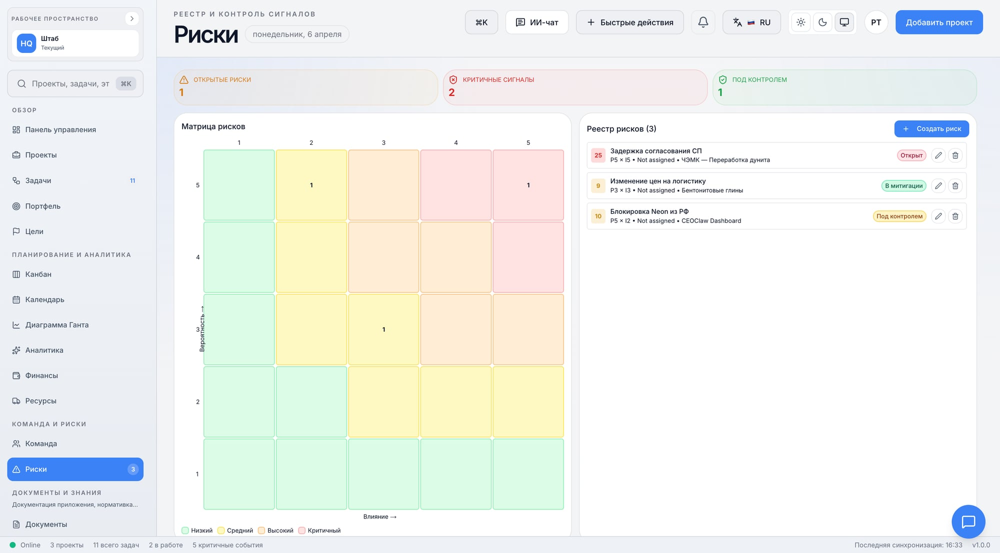
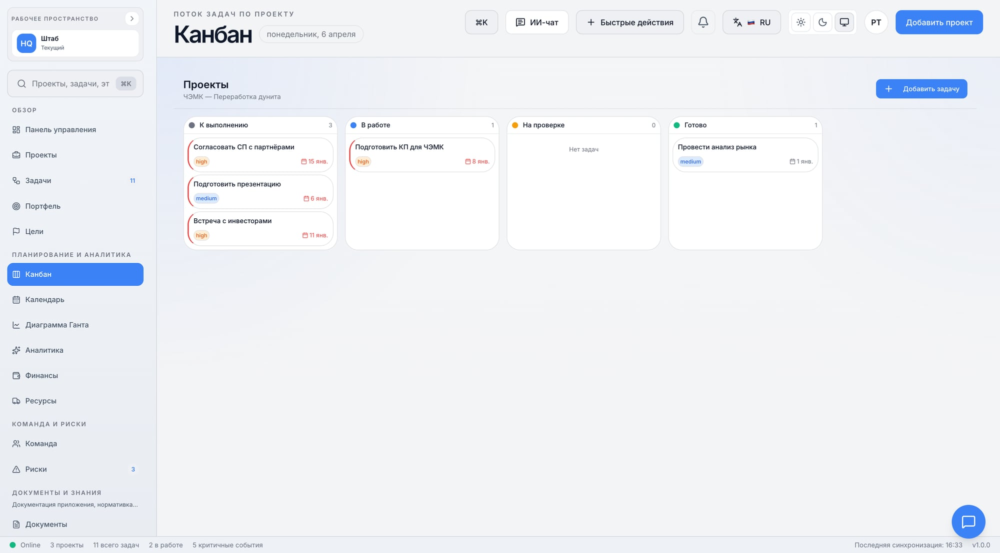

# Getting Started

## What is CEOClaw?

**CEOClaw** is an AI-powered project management platform built specifically for construction companies. It combines traditional PM methodology (EVM, critical path, risk management) with modern AI capabilities (predictive analytics, automated reporting, intelligent agents).

## Who is it for?

| Role | How CEOClaw helps |
|------|-------------------|
| **Project Manager** | Automated reporting, delay prediction, EVM dashboards |
| **PMO Director** | Portfolio overview, strategic KPIs, resource allocation |
| **Financial Controller** | Budget tracking, variance analysis, cost forecasting |
| **CFO / CEO** | Executive dashboards, ROI tracking, decision support |
| **Engineer / Foreman** | Task management, photo documentation, mobile access |

**Target company size:** 50 to 500+ employees in construction, mining, or infrastructure.

## What problems does it solve?

### Problem 1: Tool Fragmentation
> "We use WhatsApp for communication, Excel for budgets, email for approvals, and paper for site documentation."

**CEOClaw:** Single platform — tasks, budgets, documents, communication, and AI analysis in one place.

### Problem 2: Late Problem Detection
> "We find out about budget overruns 2 months too late."

**CEOClaw:** Real-time EVM analytics with AI-powered delay prediction. Problems flagged before they escalate.

### Problem 3: Reporting Overhead
> "Our PMs spend 40% of their time writing reports instead of managing projects."

**CEOClaw:** Automated weekly/monthly reports in one click. AI generates narratives from project data.

### Problem 4: No Arctic/Remote Tools
> "Nothing works well when you're 200km from the nearest cell tower."

**CEOClaw:** Designed for harsh environments — offline mode, GPS/GLONASS integration, photo documentation with geotags.

## How to Get Access

CEOClaw is currently in **beta**:

1. **Join the Telegram channel:** [t.me/ceoclaw](https://t.me/ceoclaw)
2. **Request beta access:** [t.me/ceoclaw_beta](https://t.me/ceoclaw_beta)
3. **Email:** alex@ceoclaw.com

## Quick Tour

| Screen | What you see |
|--------|-------------|
|  | Portfolio overview with AI insights |
|  | All projects with status, budget, timeline |
|  | AI-powered scheduling with critical path |
|  | EVM metrics, trends, predictions |
|  | Ask questions about your projects in natural language |
|  | Risk matrix with AI-generated mitigation |
|  | Task board with drag-and-drop |

## Next Steps

- [Features overview](features.md) — what's available now and what's coming
- [Roadmap](roadmap.md) — development timeline
- [AI-PMO concept](ai-pmo/concept.md) — how AI agents work
- [Use cases](use-cases/) — industry-specific examples
